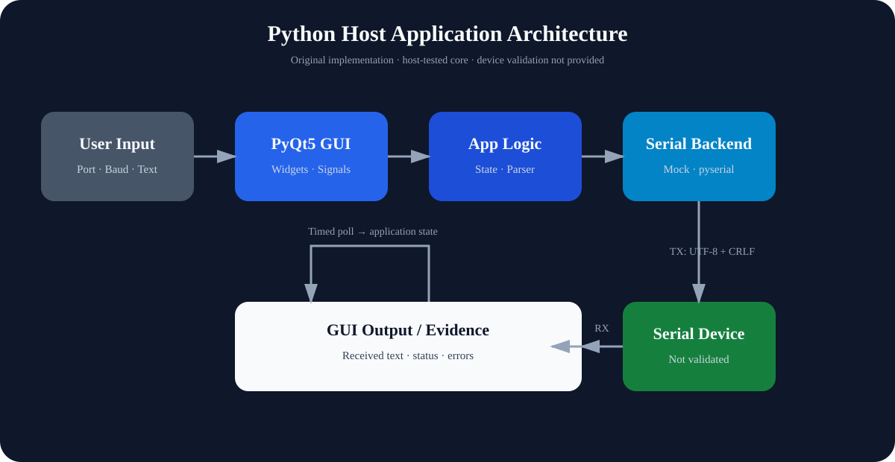

# Python-Host-Application-Lab

面向嵌入式设备串口上位机的 Python / PyQt5 架构与验证边界文档实验。

**🖥️ Host Application Data Path**



本仓库聚焦桌面 GUI、应用逻辑与串口通信之间的职责划分，并明确区分源码审查、语法检查、程序启动和真实设备验证。当前公开内容是架构文档，不包含可运行应用源码。

## 📌 Overview

Python 上位机通常位于用户操作与外部串口设备之间：GUI 收集连接参数和发送内容，应用层协调状态，通信层负责端口枚举与字节流收发。该仓库整理这一最小数据路径、并发风险和验证方法，为后续从可审计源码重建可运行实现提供边界清晰的技术基线。

## 🧰 Platform & Technology

| Field | Current Scope |
| --- | --- |
| Repository type | Documentation / Architecture Lab |
| Public content | Markdown and repository-authored SVG |
| Reference language | Python 3 |
| Reference GUI | PyQt5 widgets and signal / slot interaction |
| Reference communication | USB serial / UART through `pyserial` |
| Reference data model | Line-oriented text, GBK decoding, CRLF transmit suffix |
| Device target | Unspecified external serial device |
| Verification | Source review plus documentation and asset checks |

`PyQt5` 与 `pyserial` 仅用于描述被审查资料中可确认的技术路径；本仓库未分发这些依赖，也未提供可运行 Python 应用。

## 🏗️ Architecture

公开架构图表达两个方向：

- TX：用户输入经过 GUI 与应用逻辑后，由串口通信层发送到外部设备。
- RX：设备字节流由串口读取路径接收，再更新应用状态和界面输出。

被审查资料显示了运行时端口枚举、波特率选择、文本收发和后台读取线程；没有证据支持帧头、长度、校验和、CRC、重连状态机或工业协议实现。线程模型中存在阻塞读取和后台线程直接触碰 GUI 状态的风险，因此这里将其记录为设计约束，而不是已解决能力。

详见 [System Architecture](docs/system-architecture.md) 与 [Communication Flow](docs/communication-flow.md)。

## 🎛️ User Interface

参考界面采用 PyQt5 widgets，包含主窗口、串口页面、连接参数对话框和状态栏交互。资料中还存在 Bluetooth 页面占位内容，但未发现蓝牙扫描、连接或数据交换实现，因此 Bluetooth 不属于本仓库的已实现能力。

## 🔌 Communication

可确认的串口行为包括：

- 通过 `serial.tools.list_ports` 枚举端口。
- 在运行时选择端口与常见波特率。
- 使用 `serial.Serial` 打开、关闭、读取和写入串口。
- 发送文本时追加 CRLF，并以 GBK 编码。
- 读取路径使用后台 `threading.Thread` 和阻塞式 `readline()`。

未确认 timeout、缓冲区策略、自动重连、错误恢复或设备身份识别。

## 🧩 Protocol

当前可确认的通信模型是行导向纯文本串口收发，不是 Modbus、CAN、MQTT、BLE 或自定义二进制帧协议。公开文档不会将普通 UART 文本通道描述为工业通信协议。

## ✨ Key Features

| Capability | Documentation Entry | Engineering Focus |
| --- | --- | --- |
| Bidirectional data path | [System Architecture](docs/system-architecture.md) | GUI、应用逻辑、通信层与设备边界 |
| Serial behavior inventory | [Communication Flow](docs/communication-flow.md) | 端口发现、连接参数、TX / RX 路径 |
| Concurrency boundary | [System Architecture](docs/system-architecture.md#threading-boundary) | 阻塞读取与 GUI 线程安全风险 |
| Evidence-based status | [Verification](docs/verification.md) | 区分静态审查、运行和设备验证 |

## 📂 Project Structure

```text
Python-Host-Application-Lab/
├── README.md
├── LICENSE
├── THIRD_PARTY_NOTICES.md
├── assets/
│   └── images/
│       └── architecture/
│           └── python-host-application-overview.svg
└── docs/
    ├── communication-flow.md
    ├── system-architecture.md
    └── verification.md
```

仓库未创建空的 `src/`、`tests/` 或 `config/` 目录，因为当前没有权利清晰、可公开的应用源码或测试实现。

## 📚 Documentation

推荐阅读顺序：

1. [System Architecture](docs/system-architecture.md)：理解 GUI、应用逻辑、串口层和设备边界。
2. [Communication Flow](docs/communication-flow.md)：查看 TX / RX、编码与连接参数。
3. [Verification](docs/verification.md)：确认哪些结论已有证据，哪些仍未验证。

## 🧪 Verification

| Verification Layer | Status | Evidence Boundary |
| --- | --- | --- |
| Source Review | PASSED | 只读审查了 129 个 Python 文件及相关 UI、资源与构建描述 |
| Syntax Validation | NOT APPLICABLE | 公开仓库不包含 Python 源码 |
| Host Test | NOT PROVIDED | 未发布自动化测试或可执行应用逻辑 |
| GUI Launch | NOT PROVIDED | 未运行或发布来源不明的课程应用 |
| Application Runtime | NOT PROVIDED | 没有公开运行实现 |
| Device Validation | NOT PROVIDED | 未连接真实串口设备 |
| Runtime Evidence | NOT PROVIDED | 未提供日志、帧追踪或运行截图 |

详细依据见 [Verification](docs/verification.md)。

## License Boundary

根目录 MIT License 仅覆盖本仓库原创的 README、文档与 SVG。PyQt5、pyserial 及其他第三方名称只作为技术引用，其软件与许可证不随仓库分发；课程源码、课件、安装包、构建产物、未知来源图片和其他权利不明资料均未纳入公开内容。详见 [THIRD_PARTY_NOTICES.md](THIRD_PARTY_NOTICES.md)。
